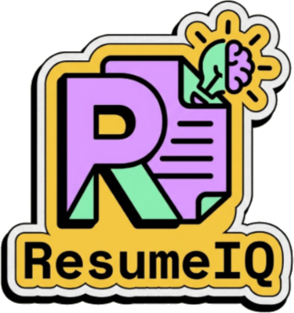

# ResumeIQ

### Multiple Agents. One Mission: Get You Hired.

**Built for the ChatGPT Codex Hackathon 2026 — Domain Agents Track**

[**Live Demo →**](https://resume-iq-teal.vercel.app)

---

## The Problem

Job hunting isn't broken because of some mythical "75% of resumes are rejected by robots" but the process rewards pattern-matching over potential.

**ResumeIQ exists to close that gap** — not with one generic AI wrapper, but with a coordinated suite of domain-specific agents, each owning one real step of the job search.

---

## Meet the Agents

| Job-Search Step                          | Who Normally Does It                   | ResumeIQ's Agent                            |
| ---------------------------------------- | -------------------------------------- | ------------------------------------------- |
| Screen a resume against ATS rules & a JD | A recruiter, or guesswork              | **Home** — ATS Resume Analyzer & JD Matcher |
| Rewrite weak bullet points               | The applicant, alone, with no feedback | **Job Tracker** — Kanban Dashboard          |
| Write a tailored cover letter per role   | A blank page, every single time        | **Cover Letter Generator** (3 tones)        |
| Rehearse interview answers               | A mirror, a friend, or nobody          | **Mock Interview** (text + live voice)      |
| Self-assess reasoning/aptitude           | Generic, joyless online tests          | **IQ Test Suite**                           |
| Take an actual break                     | Doomscrolling                          | **The Arena** — hidden retro platformer     |

### A closer look

- **Home — ATS Resume Analyzer & JD Matcher.** Upload a resume (PDF/Word). No JD → pure ATS-compatibility score. Paste a JD → a job-match score instead, with a full "what matched / what's missing / what to fix" breakdown on its own Report page.
- **Job Tracker.** Drag-and-drop Kanban across Applied → Interviewing → Offer → Rejected, backed by real persistence, not local storage theater.
- **Cover Letter Generator.** Three tones mapped to real situations: **Friendly** (warm referral/HR contact), **Confident** (cold application), **Formal** (traditional, buttoned-up). One click, grounded in your actual resume and the actual job.
- **Mock Interview.** Custom technical + behavioral questions generated from the target JD, run as a live voice conversation (via Vapi) or a text back-and-forth — either way, instant feedback.
- **IQ Test Suite.** A terminal-styled, 20-question, 45-seconds-per-question assessment with a Review Screen and a percentile-scored Results page. Proof that rigorous doesn't have to mean joyless.
- **The Arena.** A hidden retro platformer, one click from the dashboard, for the five-minute break every job search actually needs. Desktop-only for now — mobile's on the roadmap. Look for the hidden pixel mushrooms scattered through the app.

---

## The Vibe

Open ten career-tech products and they all blur together: soft gradients, glassmorphism, muted blues. ResumeIQ goes the other way on purpose:

- Thick, unapologetic black borders on every panel and control
- Hard-offset shadows instead of soft blurs
- A loud flat-pastel palette (amber, coral, mint, sky, lavender)
- Dual-font system: Space Mono / JetBrains Mono for structure and data, Space Grotesk / Plus Jakarta Sans for voice and warmth

— a tool for one of life's most stressful processes shouldn't look like it's afraid of its own users.

---

## Under the Hood

| Layer            | Technology                                       |
| ---------------- | ------------------------------------------------ |
| Frontend         | React (Vite) + React Router, Tailwind CSS        |
| API Gateway      | Spring Cloud Gateway                             |
| Backend          | Java 17, Spring Boot, Spring Security            |
| Database         | PostgreSQL (prod) · H2 (automated tests)         |
| AI Orchestration | LangChain4j → Google Gemini (`gemini-2.5-flash`) |
| Voice Interviews | Vapi real-time conversational pipeline           |
| Auth             | Local (BCrypt) + Google/GitHub OAuth             |

Gemini was chosen deliberately over OpenAI's API for its usable free tier. The voice pipeline runs through Vapi, which maintains its own model whitelist separate from the Gemini SDK — the codebase keeps `GEMINI_MODEL_TEXT` and `GEMINI_MODEL_VAPI` as distinct constants so a change on one surface never silently breaks the other.

## Security & Reliability

A career tool touches resumes, personal details, and application history — so this wasn't an afterthought:

- **Auth:** local accounts use BCrypt-hashed passwords; Google/GitHub OAuth also supported.
- **Rate limiting:** Bucket4j caps requests (e.g. 5/min per IP) to protect the Gemini-backed AI endpoints from abuse.
- **Anti-enumeration:** auth endpoints return deliberately consistent responses regardless of whether an email exists, closing off the classic scraping pattern.
- **Hardening pass:** an IP-spoofing gap in the rate limiter (trusting a client-controlled `X-Forwarded-For` header) and an unbounded in-memory cache were both found and closed before ship.

---

**Codex — implementation, debugging, review loops.** Codex generated the first-pass implementation for each agent, drove iterative debugging (including the Vapi ESM/CJS interop bug and the IQ test scoring error), and carried most of the write-test-refine loop that takes a feature from "working once" to "working reliably."
**ChatGPT — research, planning, documentation.** ChatGPT handled functionality planning and shaped executable prompts before Codex implemented them, and supported the research behind the problem statement above. Routing planning-heavy work to ChatGPT kept Codex's tokens free for implementation and debugging.
**Other AI tools** were brought in selectively to assist on select engineering tasks alongside Codex and ChatGPT.

Codex and ChatGPT accelerated the build. The engineering judgment behind what got built and whether it actually worked didn't come from either one.

---

## Try It Live

**[resume-iq-teal.vercel.app](https://resume-iq-teal.vercel.app/)**

---

## What's Next

**Per feature:** direct-apply from the Job Tracker · speech-to-text cover letter drafting · long-term memory for Mock Interview (skill level and progress persisted across sessions) · experience-aware fit scoring on Home · mobile support for the Arena · deeper motion/animation polish.

**Bigger ideas:**

- **Application Command Center** — one per-job view pulling ATS score, JD match, cover letter, interview prep, and tracker status into a single case file, instead of six separate screens.
- **Learning Roadmap Generator** — feed in a GitHub profile or portfolio, get a concrete, step-by-step plan for closing the gap to a target role.

---

_Built for the Domain Agents track because a career isn't a general-purpose problem._
_It's a domain, and it deserves agents that know it._

